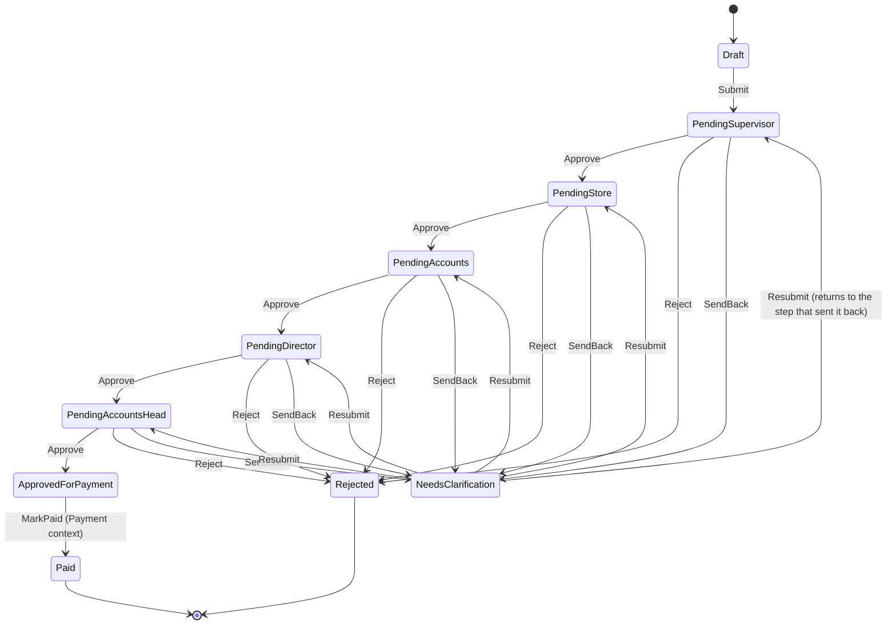

# AEMS — Software Design Document

Status: v1 design, covers the confirmed flat workflow from
[WORKFLOW.md](WORKFLOW.md). Field-level detail (expense categories, exact
form layout) still waits on real BRD/FRD input — this document designs the
*mechanism*, not the business content that flows through it.

## 1. Domain model — aggregates

### ExpenseRequest (aggregate root, `Expense` context)
- `Id` (GUID), `RequesterId`, `Category` (string — real category list TBD),
  `Amount`, `CurrencyCode` (fixed `"INR"` for now — named CurrencyCode, not
  Currency, to avoid colliding with the VBA built-in `Currency` data type),
  `Description`,
  `LineItems` (collection of `ExpenseLineItem`), `Attachments` (collection of
  file references), `Status` (`ExpenseStatus`), `CreatedAt`, `CreatedBy`,
  `ModifiedAt`, `ModifiedBy`.
- Owns one `ApprovalChain` (composition — an `ExpenseRequest` is meaningless
  without its chain, and vice versa; they're saved together).

### ApprovalChain (part of the `Expense` aggregate, behavior lives in `Approval` context)
- `ExpenseId`, `Steps` (ordered collection of `ApprovalStep`, fixed at chain
  creation: Supervisor, Store, Accounts, Director, Accounts Head),
  `CurrentStepIndex`, `History` (append-only collection of `ApprovalHistoryEntry`).
- Behavior (methods, not external service — see §3):
  `Approve(actorId, comment)`, `Reject(actorId, reason)`,
  `SendBack(actorId, reason)`, `Resubmit(actorId)`, `Escalate(actorId, toUserId)`,
  `Reassign(fromUserId, toUserId)`.

### ApprovalStep (value-ish object, part of `ApprovalChain`)
- `Role` (`ApprovalRole` enum), `AssignedUserId`, `Status`
  (`ApprovalStepStatus`: Pending / Approved / Rejected / SentBack / Skipped),
  `ActedBy`, `ActedAt`, `Comment`.

### ApprovalHistoryEntry (immutable, part of `ApprovalChain`)
- `ExpenseId`, `StepRole`, `Action` (`ApprovalAction` enum), `ActorId`,
  `Timestamp`, `Comment`. Never edited or deleted once written.

### PaymentRecord (aggregate root, `Payment` context)
- `ExpenseId`, `Status` (`PaymentStatus`: AwaitingPayment / Paid / Reversed),
  `PaidAt`, `PaidBy`, `PaymentReference`, `Method` (values TBD — pending BRD).

## 2. State machine



`Escalate` and `Reassign` do not change `Status` — they change
`ApprovalStep.AssignedUserId` for the current step and write a history entry.
This keeps the state machine's node count small; escalation/reassignment is
an orthogonal concern (who acts), not a new status.

`NeedsClarification → Pending<Role>` targets whichever role's step originally
sent it back — tracked via a `ReturnToStepIndex` field set by `SendBack` and
read by `Resubmit`.

## 3. Why behavior lives on the aggregate, not a separate "workflow engine" class

Per [CODING_STANDARDS.md](CODING_STANDARDS.md) §3 (KISS): there is exactly one
workflow today. A generic, config-driven workflow engine would be speculative
generality with no second use case to validate it against. `ApprovalChain`
enforces its own legal transitions (e.g. `Approve` raises an error if
`CurrentStepIndex` step is not `Pending`) — simple, testable, no framework.
If/when a second, differently-shaped workflow is needed (a different ABP
module), extract the common shape then, from two real examples instead of one
guess.

## 4. Repository interfaces (domain-facing, no Excel vocabulary)

```
IExpenseRepository
  GetById(id As String) As ExpenseRequest
  GetByStatus(status As ExpenseStatus) As Collection
  GetByRequester(requesterId As String) As Collection
  Save(expense As ExpenseRequest)

IPaymentRepository
  GetByExpenseId(expenseId As String) As PaymentRecord
  GetAwaitingPayment() As Collection
  Save(payment As PaymentRecord)
```

`ApprovalChain` and its `Steps`/`History` are persisted as part of
`ExpenseRequest.Save` — they are not independently addressable aggregates.

## 5. Application layer use cases

One class per use case (`modules/expense/application`), each: loads via
repository, calls the aggregate's behavior method, saves, returns a
result/error to the caller. None contain business rules themselves.

`SubmitExpenseUseCase`, `ApproveStepUseCase`, `RejectStepUseCase`,
`SendBackUseCase`, `ResubmitExpenseUseCase`, `EscalateStepUseCase`,
`ReassignStepUseCase`, `MarkPaidUseCase`.

## 6. Error model

VBA custom errors, one number range per bounded context, raised by the
domain layer and translated to user-facing text only in Presentation:

| Range | Context |
|---|---|
| 10000–10099 | Expense |
| 10100–10199 | Approval |
| 10200–10299 | Payment |

Example: `Err.Raise 10101, "ApprovalChain.Approve", "Cannot approve: current step is not Pending."`

## 7. Still TBD (blocks FRD-level detail, not this design)

Real expense categories, real field list on the submission form, real
attachment size/type rules, escalation timeout, payment method values — see
[BRD.md](BRD.md) §6 and [WORKFLOW.md](WORKFLOW.md) "Open questions".
